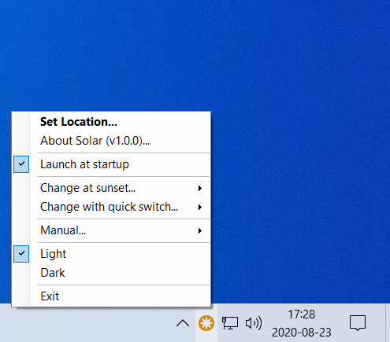
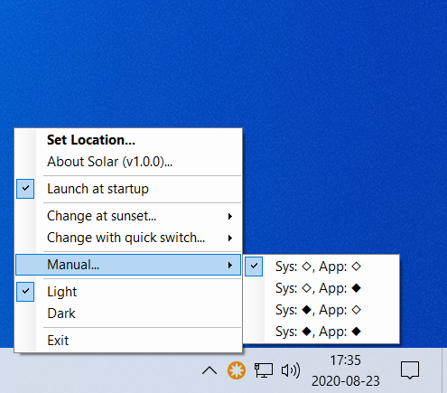
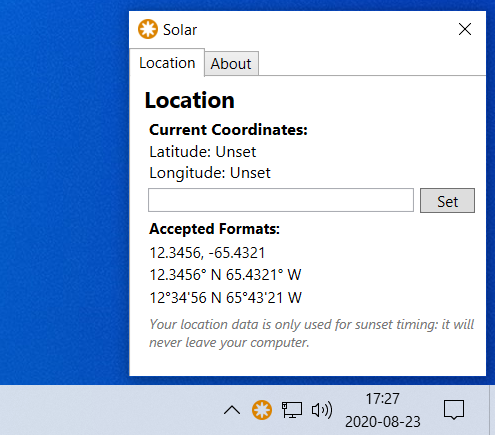
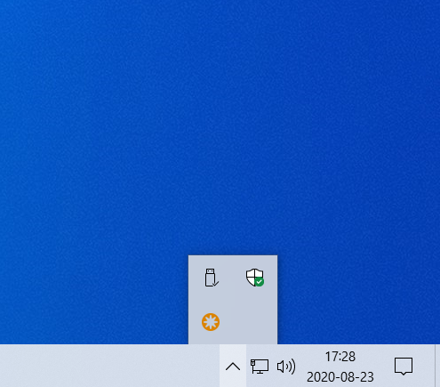

# Solar

Solar is a native Windows app that switches the system and/or app theme to Dark at sunset and Light at sunrise. It also allows more convenient access to theme switching.

Download the latest release [here](https://github.com/AlpacaFur/Solar/releases/tag/v1.0.0)!

## Features
- Tray Menu Application
  - Solar lives in your tray menu so as not to clutter your desktop or taskbar with another window.
  - All of Solar's functions can be accessed by right-clicking on Solar's icon and choosing the appropriate option.
- Switches theme at sunset
  - The app uses [CoordinateSharp](https://github.com/Tronald/CoordinateSharp) to dynamically calculate sunset and sunrise times at your location and switch your system and/or app themes accordingly.
  - Solar can be configured to only switch one of the themes if preferred.
- Provides convenient access to theme switching
  - Solar's menu allows quick switching between light mode and dark mode
  - Double-clicking on Solar's system tray icon is even faster and toggles the current theme.
- Provides fine-grained control of the system theme
  - Use the manual option in Solar's menu to set any combination of system themes and app themes.
- Configuration allows users to select which themes change at sunset/sunrise and when they quick switch. 
- Solar starts automatically on login for convenience
  - This setting is togglable if the user prefers that it not start automatically.
  
## Screenshots
Solar stays out of your way as much as possible, but here are a few screenshots of the UI:

## FAQ
### I installed Solar and launched it, but it doesn't show up!
Solar lives in your system tray which is located on the right side of your taskbar. Sometimes, you'll have to click the little up arrow to show Solar and your other system tray apps. If this is the case, you can drag it down to have it stay outside of the arrow box.

 

### Solar isn't switching my theme at sunset!
You probabaly haven't set your location yet right click on Solar's icon in the system tray and click `Set location...` (it's bolded until you set it). Then get the coordinates of your location (the nearest city works fine too!) and paste them into the text box. 

 

### What does Solar use my location for?
First and foremost, your location data never leaves your computer and Solar does not collect any kind of analytics or data. Solar only uses your location to calculate when sunset and sunrise is, because they change time of day based on where you are physically on Earth.

### I found a bug!
Thanks for making Solar a better app! [Create a new issue](https://github.com/AlpacaFur/Solar/issues/new/choose) describing the problem and I'll get working on a fix! If you know how to write a WPF app in C#, then you can also submit a pull request if you prefer.

### I'd like to contribute!
Thanks for making Solar a better app! Take a look in issues and see if there are any outstanding bugs or open feature requests and feel free to make a pull request implementing the bug fix or feature.
